Git 是目前最流行的分布式版本控制系统，掌握 Git 是每个开发者的必备技能。本指南将从基础概念到高阶用法，帮助你全面理解和掌握 Git。

## 1. Git 核心概念

### 1.1 什么是版本控制

版本控制是一种记录文件内容变化，以便将来查阅特定版本修订情况的系统。Git 采用分布式版本控制，每个开发者都拥有完整的代码仓库。

### 1.2 Git 的三个区域


- **工作区（Working Directory）**：你实际操作文件的目录
- **暂存区（Staging Area/Index）**：临时存放即将提交的修改
- **版本库（Repository）**：存储所有提交历史的地方（.git 目录）

### 1.3 文件的四种状态

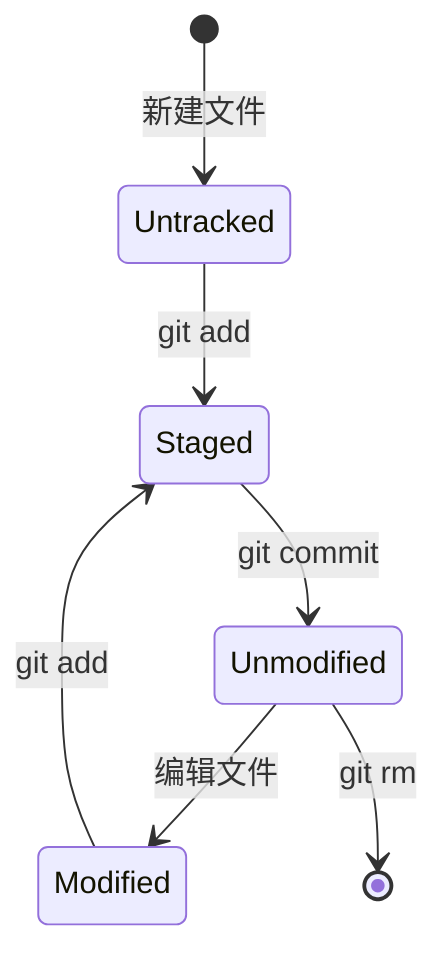

- **未跟踪（Untracked）**：新创建的文件，Git 还未开始跟踪
- **未修改（Unmodified）**：文件已提交，未做修改
- **已修改（Modified）**：文件已修改，但未暂存
- **已暂存（Staged）**：文件已修改并添加到暂存区

## 2. Git 内部原理

理解 Git 的内部工作原理，能帮助你更好地掌握各种命令的本质。

### 2.1 Git 对象模型

Git 使用四种核心对象类型来存储数据：

#### Blob 对象（文件内容）
存储文件的实际内容，不包含文件名和目录结构。

```mermaid
graph TD
    Blob["<b>Blob</b><br/>(文件内容)<br/><br/>\"Hello\"<br/>\"World\""]

    style Blob fill:#1a2332,stroke:#00f2ff,stroke-width:2px,color:#fff
```

#### Tree 对象（目录结构）
存储目录结构和文件名，指向 blob 对象或其他 tree 对象。

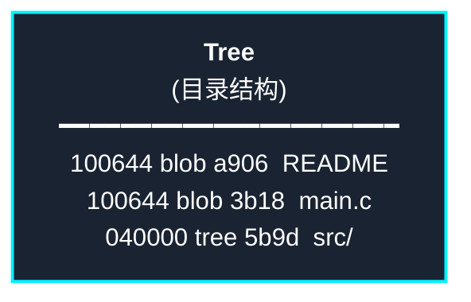

#### Commit 对象（提交信息）
存储提交的元数据，包括作者、时间、提交信息，以及指向 tree 对象和父提交的指针。

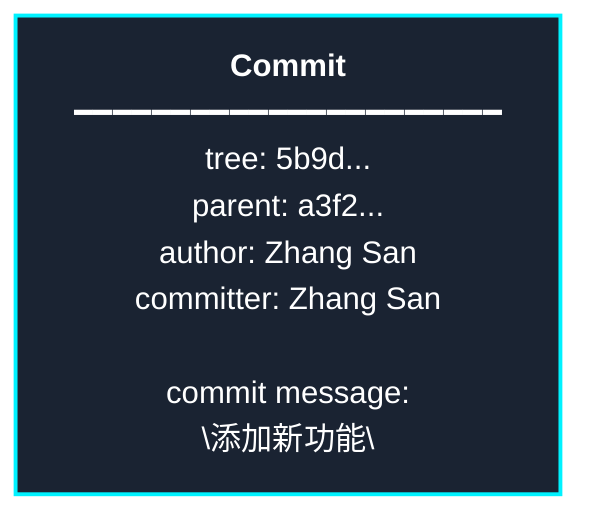

#### 完整的对象关系图

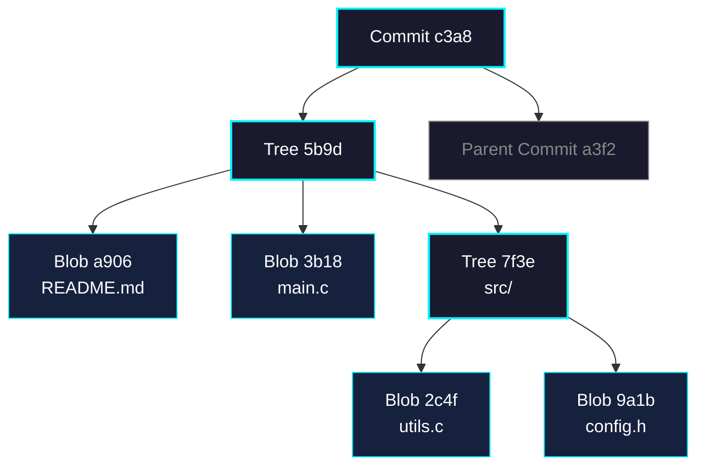

### 2.2 引用（References）

Git 使用引用来给提交起一个易读的名字，而不是使用 SHA-1 哈希值。

```
.git/refs/
├── heads/              # 本地分支
│   ├── main           → c3a8f2...
│   └── feature        → 7d9e1a...
├── remotes/           # 远程分支
│   └── origin/
│       └── main       → c3a8f2...
└── tags/              # 标签
    └── v1.0           → a3f29b...

HEAD → refs/heads/main  # HEAD 指向当前分支
```

### 2.3 分支的本质

分支只是指向某个提交对象的可变指针。创建分支非常轻量，只是创建一个 41 字节的文件（40 字符的 SHA-1 值加一个换行符）。

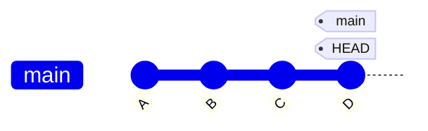

**创建新分支 feature：**
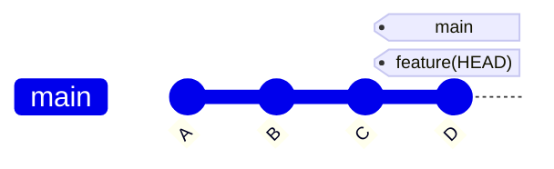

**在 feature 分支提交：**
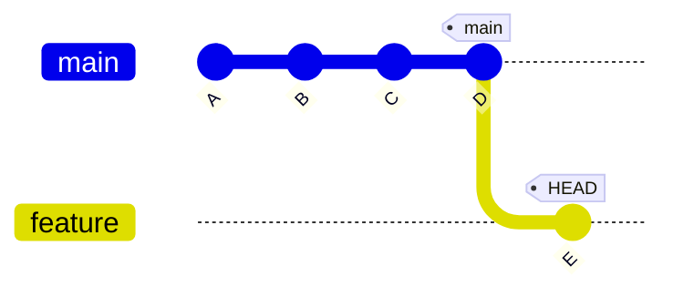

### 2.4 HEAD 指针

HEAD 是一个特殊的指针，指向当前所在的分支（或提交）。

```
正常状态（HEAD 指向分支）：
HEAD → main → C3

分离 HEAD 状态（HEAD 直接指向提交）：
HEAD → C2
```

### 2.5 查看 Git 对象

```bash
# 查看对象类型
git cat-file -t <hash>

# 查看对象内容
git cat-file -p <hash>

# 查看对象大小
git cat-file -s <hash>

# 查看所有引用
git show-ref

# 查看 HEAD 指向
cat .git/HEAD

# 查看符号引用
git symbolic-ref HEAD
```

### 2.6 Git 存储原理

Git 使用内容寻址文件系统，所有对象都通过其内容的 SHA-1 哈希值来标识。

```
文件存储流程：
1. 计算内容的 SHA-1 哈希值
2. 压缩内容
3. 存储到 .git/objects/ 目录

示例：
SHA-1: a906cb2a4a904a152e80877d4088654daad0c859
存储位置: .git/objects/a9/06cb2a4a904a152e80877d4088654daad0c859
```

## 3. Git 基础操作

### 3.1 配置 Git

```bash
# 配置用户信息
git config --global user.name "Your Name"
git config --global user.email "your.email@example.com"

# 查看配置
git config --list

# 配置默认编辑器
git config --global core.editor "code --wait"

# 配置别名
git config --global alias.st status
git config --global alias.co checkout
git config --global alias.br branch
git config --global alias.ci commit
```

### 3.2 创建仓库

```bash
# 初始化新仓库
git init

# 克隆现有仓库
git clone <repository-url>
git clone <repository-url> <directory-name>
```

### 3.3 基本工作流程

**工作流程可视化：**

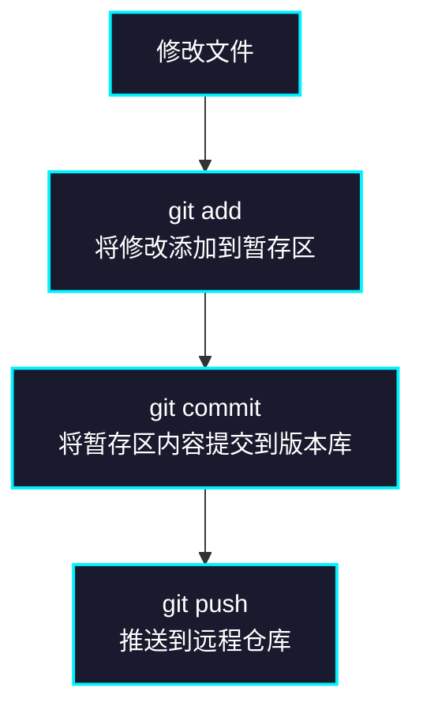

```bash
# 查看状态
git status
git status -s  # 简洁输出

# 添加文件到暂存区
git add <file>           # 添加指定文件
git add .                # 添加所有修改
git add *.js             # 添加所有 js 文件
git add -p               # 交互式添加（部分修改）

# 提交更改
git commit -m "提交信息"
git commit -am "提交信息"  # 跳过暂存区直接提交已跟踪文件
git commit --amend       # 修改最后一次提交

# 查看差异
git diff                 # 工作区与暂存区的差异
git diff --staged        # 暂存区与最后一次提交的差异
git diff HEAD            # 工作区与最后一次提交的差异
git diff <commit1> <commit2>  # 两次提交之间的差异

# 查看提交历史
git log                  # 查看提交历史
git log --oneline        # 单行显示
git log --graph          # 图形化显示分支
git log --all --graph --decorate --oneline  # 完整图形化历史
git log -p               # 显示每次提交的差异
git log --stat           # 显示每次提交的统计信息
git log --author="name"  # 查看特定作者的提交
git log --since="2 weeks ago"  # 查看最近两周的提交
git log --grep="关键词"   # 搜索提交信息

# 撤销操作
git restore <file>       # 撤销工作区的修改
git restore --staged <file>  # 取消暂存
git reset HEAD <file>    # 取消暂存（旧方法）
git checkout -- <file>   # 撤销工作区修改（旧方法）
```

### 3.4 删除和移动文件

```bash
# 删除文件
git rm <file>            # 删除文件并暂存
git rm --cached <file>   # 从 Git 中删除但保留在工作区
git rm -r <directory>    # 递归删除目录

# 移动/重命名文件
git mv <old-name> <new-name>
```

## 4. 分支管理

### 4.1 分支基础

**分支可视化：**

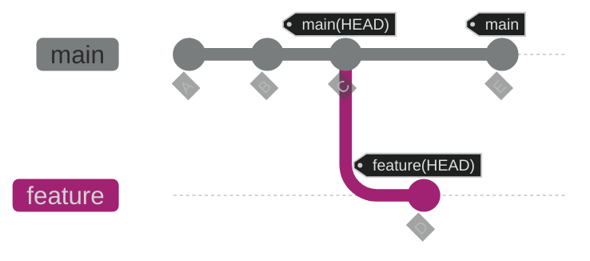

```bash
# 查看分支
git branch               # 查看本地分支
git branch -r            # 查看远程分支
git branch -a            # 查看所有分支
git branch -v            # 查看各分支最后一次提交

# 创建分支
git branch <branch-name>
git checkout -b <branch-name>  # 创建并切换
git switch -c <branch-name>    # 创建并切换（新命令）

# 切换分支
git checkout <branch-name>
git switch <branch-name>       # 新命令

# 删除分支
git branch -d <branch-name>    # 删除已合并的分支
git branch -D <branch-name>    # 强制删除分支

# 重命名分支
git branch -m <old-name> <new-name>
git branch -m <new-name>       # 重命名当前分支
```

### 4.2 合并分支

#### Merge 合并可视化

**快进合并（Fast-forward）**：

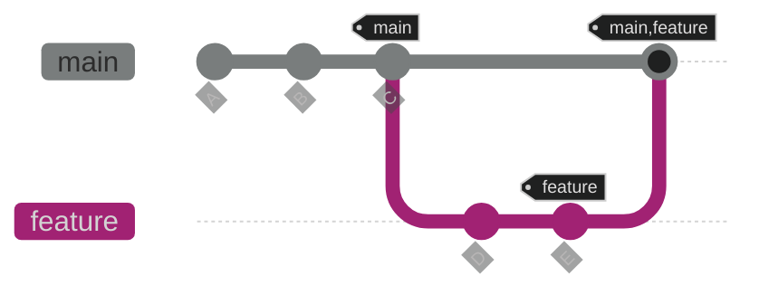

**三方合并（3-way merge）**：

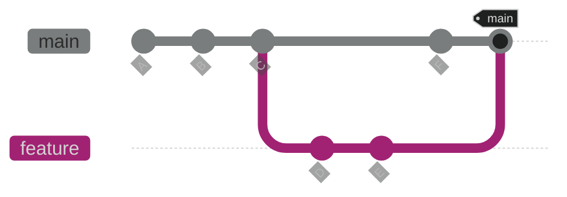

```bash
# 合并分支
git merge <branch-name>        # 合并指定分支到当前分支
git merge --no-ff <branch-name>  # 禁用快进合并
git merge --squash <branch-name>  # 压缩合并

# 解决冲突
# 1. 手动编辑冲突文件
# 2. git add <file>
# 3. git commit

# 中止合并
git merge --abort
```

### 4.3 变基（Rebase）

#### Rebase vs Merge 对比

**Merge 方式（保留完整历史，产生合并提交）**：


**Rebase 方式（提交历史呈线性）**：

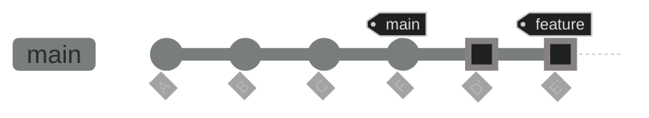

**Rebase 原理**：
1. 找到共同祖先 C
2. 提取 feature 分支的修改（D, E）
3. 将这些修改应用到 main 分支的最新提交 F 之后
4. 生成新的提交 D', E'（哈希值改变）

```bash
# 变基操作
git rebase <branch-name>       # 将当前分支变基到指定分支
git rebase --continue          # 解决冲突后继续
git rebase --abort             # 中止变基
git rebase --skip              # 跳过当前提交

# 交互式变基
git rebase -i HEAD~3           # 修改最近 3 次提交
# 可以进行：
# - pick: 保留提交
# - reword: 修改提交信息
# - edit: 修改提交内容
# - squash: 合并到前一个提交
# - fixup: 合并到前一个提交但丢弃提交信息
# - drop: 删除提交
```

## 5. 远程仓库操作

### 5.1 远程仓库管理

```bash
# 查看远程仓库
git remote                     # 查看远程仓库名称
git remote -v                  # 查看远程仓库 URL
git remote show <remote-name>  # 查看远程仓库详细信息

# 添加远程仓库
git remote add <name> <url>

# 修改远程仓库
git remote rename <old-name> <new-name>
git remote set-url <name> <new-url>

# 删除远程仓库
git remote remove <name>
```

### 5.2 推送和拉取

**远程仓库交互可视化：**

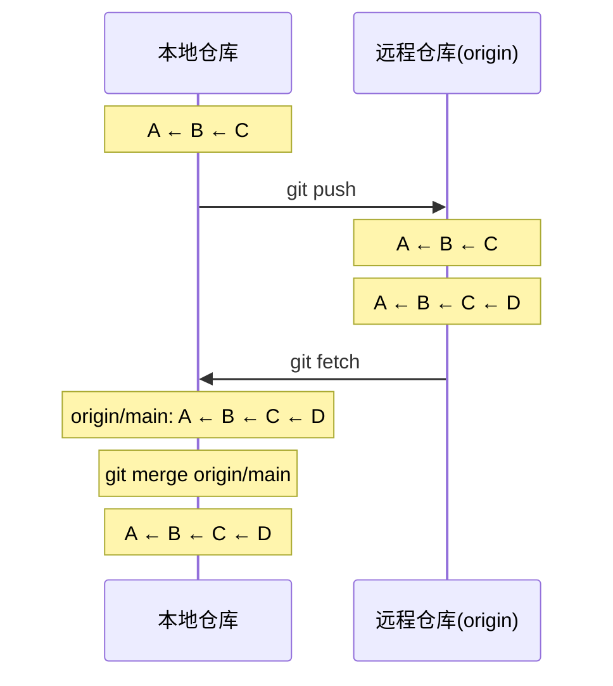

```bash
# 推送到远程仓库
git push <remote> <branch>
git push origin main
git push -u origin main        # 设置上游分支
git push --all                 # 推送所有分支
git push --tags                # 推送所有标签
git push --force               # 强制推送（危险操作）
git push --force-with-lease    # 更安全的强制推送

# 拉取远程更新
git fetch <remote>             # 获取远程更新但不合并
git fetch --all                # 获取所有远程仓库的更新
git pull <remote> <branch>     # 获取并合并
git pull --rebase              # 使用变基方式拉取

# 删除远程分支
git push <remote> --delete <branch-name>
git push <remote> :<branch-name>  # 旧语法
```

## 6. 标签管理

```bash
# 查看标签
git tag                        # 列出所有标签
git tag -l "v1.8.*"           # 搜索标签

# 创建标签
git tag <tag-name>             # 轻量标签
git tag -a <tag-name> -m "标签信息"  # 附注标签
git tag -a <tag-name> <commit-hash>  # 给特定提交打标签

# 查看标签信息
git show <tag-name>

# 推送标签
git push origin <tag-name>
git push origin --tags         # 推送所有标签

# 删除标签
git tag -d <tag-name>          # 删除本地标签
git push origin --delete <tag-name>  # 删除远程标签
```

## 7. 高阶操作

### 7.1 储藏（Stash）

**储藏工作流程：**

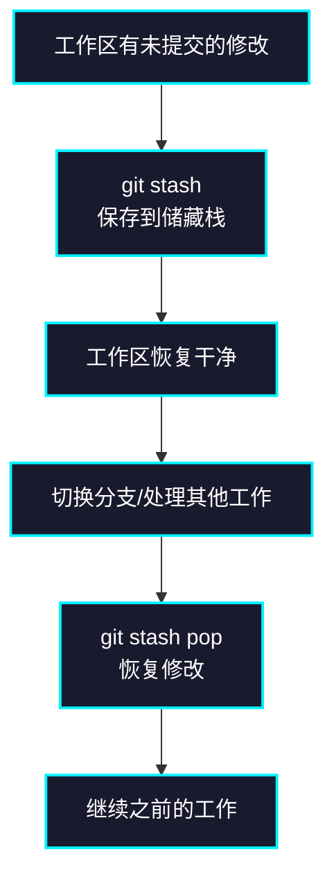

```bash
# 储藏当前工作
git stash                      # 储藏修改
git stash save "描述信息"       # 带描述的储藏
git stash -u                   # 包括未跟踪的文件
git stash --all                # 包括所有文件（含忽略的）

# 查看储藏
git stash list                 # 查看所有储藏
git stash show                 # 查看最新储藏的差异
git stash show -p stash@{0}    # 查看指定储藏的详细差异

# 应用储藏
git stash apply                # 应用最新储藏
git stash apply stash@{2}      # 应用指定储藏
git stash pop                  # 应用并删除最新储藏

# 删除储藏
git stash drop stash@{0}       # 删除指定储藏
git stash clear                # 删除所有储藏
```

### 7.2 Cherry-pick

**Cherry-pick 可视化：**

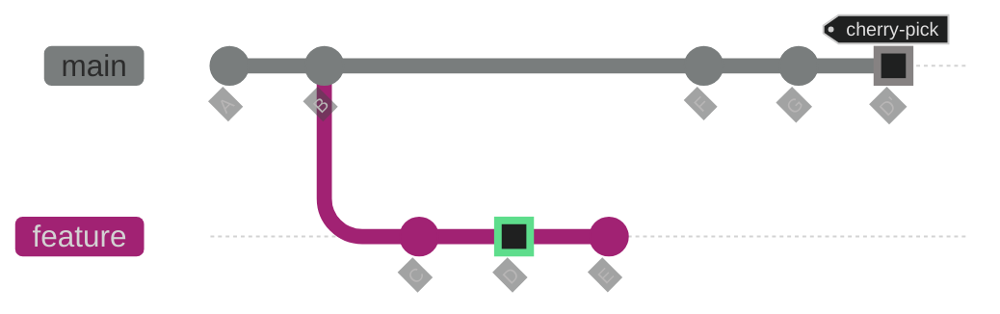

只挑选了 D 提交，生成新的 D'

```bash
# 挑选提交
git cherry-pick <commit-hash>  # 应用指定提交
git cherry-pick <commit1> <commit2>  # 应用多个提交
git cherry-pick <start-commit>..<end-commit>  # 应用提交范围

# 解决冲突
git cherry-pick --continue     # 继续
git cherry-pick --abort        # 中止
```

### 7.3 重置（Reset）

**Reset 三种模式对比：**

| 模式 | 工作区 | 暂存区 | 版本库 | 说明 |
|------|--------|--------|--------|------|
| **初始状态** | file.txt (modified) | file.txt (staged) | A ← B ← C (HEAD) | - |
| **--soft** | ✓ 保留 | ✓ 保留 | ✗ 回退到 B | 只移动 HEAD |
| **--mixed** (默认) | ✓ 保留 | ✗ 清空 | ✗ 回退到 B | 移动 HEAD + 重置暂存区 |
| **--hard** | ✗ 清空 | ✗ 清空 | ✗ 回退到 B | 完全重置（危险） |

```bash
# 软重置（保留修改在暂存区）
git reset --soft HEAD~1

# 混合重置（保留修改在工作区，默认）
git reset HEAD~1
git reset --mixed HEAD~1

# 硬重置（丢弃所有修改，危险）
git reset --hard HEAD~1
git reset --hard <commit-hash>

# 重置到远程分支状态
git reset --hard origin/main
```

### 7.4 Reflog（引用日志）

**Reflog 救援示例：**

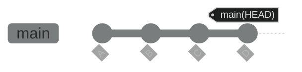

**误操作后（git reset --hard B）：**
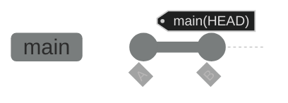

提交 C 和 D 看似丢失了！

**使用 git reflog 查看：**
```
b3a8f2 HEAD@{0}: reset: moving to B
d4c9e1 HEAD@{1}: commit: D
c7f3a2 HEAD@{2}: commit: C
```

**恢复（git reset --hard d4c9e1）：**
```mermaid
%%{init: {'theme':'dark'}}%%
gitGraph
    commit id: "A"
    commit id: "B"
    commit id: "C"
    commit id: "D" tag: "main(HEAD)恢复"
```

```bash
# 查看引用日志
git reflog                     # 查看所有操作历史
git reflog show <branch-name>  # 查看指定分支的历史

# 恢复丢失的提交
git reset --hard <commit-hash>  # 使用 reflog 中的哈希值恢复
```

### 7.5 子模块（Submodule）

```bash
# 添加子模块
git submodule add <repository-url> <path>

# 克隆包含子模块的仓库
git clone --recursive <repository-url>

# 初始化和更新子模块
git submodule init
git submodule update
git submodule update --remote  # 更新到最新版本

# 查看子模块状态
git submodule status

# 删除子模块
git submodule deinit <path>
git rm <path>
```

### 7.6 工作树（Worktree）

```bash
# 创建工作树
git worktree add <path> <branch-name>

# 查看工作树
git worktree list

# 删除工作树
git worktree remove <path>
git worktree prune             # 清理无效的工作树
```

## 8. 实用技巧

### 8.1 搜索和查找

```bash
# 在提交历史中搜索
git log -S "关键词"            # 搜索添加或删除了关键词的提交
git log -G "正则表达式"         # 使用正则表达式搜索

# 在工作区搜索
git grep "关键词"              # 在工作区搜索
git grep -n "关键词"           # 显示行号
git grep --count "关键词"      # 显示匹配次数

# 查找引入 bug 的提交
git bisect start
git bisect bad                 # 标记当前版本有问题
git bisect good <commit>       # 标记某个版本正常
# Git 会自动二分查找，测试后标记 good 或 bad
git bisect reset               # 结束查找
```

### 8.2 别名和快捷方式

```bash
# 实用别名配置
git config --global alias.lg "log --color --graph --pretty=format:'%Cred%h%Creset -%C(yellow)%d%Creset %s %Cgreen(%cr) %C(bold blue)<%an>%Creset' --abbrev-commit"
git config --global alias.unstage "reset HEAD --"
git config --global alias.last "log -1 HEAD"
git config --global alias.visual "log --graph --all --oneline --decorate"
```

### 8.3 忽略文件

创建 `.gitignore` 文件：

```gitignore
# 忽略所有 .log 文件
*.log

# 忽略 node_modules 目录
node_modules/

# 忽略所有 .env 文件
.env
.env.local

# 但不忽略 .env.example
!.env.example

# 忽略 build 目录
/build

# 忽略所有 .pdf 文件，除了 doc/ 目录下的
*.pdf
!doc/*.pdf
```

全局忽略文件：

```bash
git config --global core.excludesfile ~/.gitignore_global
```

### 8.4 清理和维护

```bash
# 清理未跟踪的文件
git clean -n                   # 预览将要删除的文件
git clean -f                   # 删除未跟踪的文件
git clean -fd                  # 删除未跟踪的文件和目录
git clean -fX                  # 只删除被忽略的文件

# 垃圾回收和优化
git gc                         # 垃圾回收
git gc --aggressive            # 更彻底的优化

# 检查仓库完整性
git fsck                       # 检查对象完整性

# 查看仓库大小
git count-objects -vH
```

## 9. 最佳实践

### 9.1 提交信息规范

```
<type>(<scope>): <subject>

<body>

<footer>
```

常用类型：
- `feat`: 新功能
- `fix`: 修复 bug
- `docs`: 文档更新
- `style`: 代码格式调整
- `refactor`: 重构
- `test`: 测试相关
- `chore`: 构建/工具相关

示例：
```
feat(user): 添加用户登录功能

- 实现用户名密码登录
- 添加记住密码功能
- 集成第三方登录

Closes #123
```

### 9.2 分支策略

**Git Flow 可视化**：

```mermaid
%%{init: {'theme':'dark'}}%%
gitGraph
    commit id: "init"
    branch develop
    checkout develop
    commit id: "dev1"
    branch feature/login
    checkout feature/login
    commit id: "login1"
    commit id: "login2"
    checkout develop
    merge feature/login
    branch feature/payment
    checkout feature/payment
    commit id: "pay1"
    checkout develop
    commit id: "dev2"
    checkout main
    branch hotfix/bug-fix
    commit id: "hotfix"
    checkout main
    merge hotfix/bug-fix tag: "v1.0.1"
    checkout develop
    branch release/1.0
    checkout release/1.0
    commit id: "rc1"
    checkout main
    merge release/1.0 tag: "v1.0"
```

**GitHub Flow 可视化**：

```mermaid
%%{init: {'theme':'dark'}}%%
gitGraph
    commit id: "A"
    commit id: "B"
    branch feature/new-ui
    checkout feature/new-ui
    commit id: "UI-1"
    commit id: "UI-2"
    checkout main
    merge feature/new-ui tag: "PR merged"
    commit id: "C"
    branch bugfix/issue-123
    checkout bugfix/issue-123
    commit id: "fix"
    checkout main
    merge bugfix/issue-123 tag: "PR merged"
```

**Git Flow**：
- `main`: 生产环境分支
- `develop`: 开发分支
- `feature/*`: 功能分支
- `release/*`: 发布分支
- `hotfix/*`: 热修复分支

**GitHub Flow**（简化版）：
- `main`: 主分支
- `feature/*`: 功能分支
- 通过 Pull Request 合并

### 9.3 常见问题解决

```bash
# 撤销已推送的提交
git revert <commit-hash>       # 创建新提交来撤销

# 修改已推送的提交信息（危险）
git commit --amend
git push --force-with-lease

# 合并多个提交
git rebase -i HEAD~n

# 恢复误删的分支
git reflog
git checkout -b <branch-name> <commit-hash>

# 解决"detached HEAD"状态
git checkout -b <new-branch-name>  # 创建新分支保存工作
git checkout <branch-name>         # 或切换回原分支

# 更改远程仓库 URL
git remote set-url origin <new-url>

# 清除本地已删除的远程分支引用
git fetch --prune
git remote prune origin
```

## 10. 总结

Git 是一个功能强大的版本控制系统，掌握它需要时间和实践。建议：

1. **从基础开始**：先掌握 add、commit、push、pull 等基本操作
2. **理解原理**：了解 Git 的三个区域和文件状态
3. **多练习**：在实际项目中使用，遇到问题及时查阅文档
4. **学习高级功能**：逐步掌握 rebase、cherry-pick、stash 等高级操作
5. **遵循规范**：养成良好的提交习惯和分支管理习惯

### 推荐资源

- [Pro Git 中文版](https://git-scm.com/book/zh/v2)
- [Learn Git Branching](https://learngitbranching.js.org/?locale=zh_CN)
- [Git 官方文档](https://git-scm.com/docs)
- [GitHub Git 备忘单](https://training.github.com/downloads/zh_CN/github-git-cheat-sheet/)

掌握 Git 不仅能提高工作效率，更能让你在团队协作中游刃有余！
