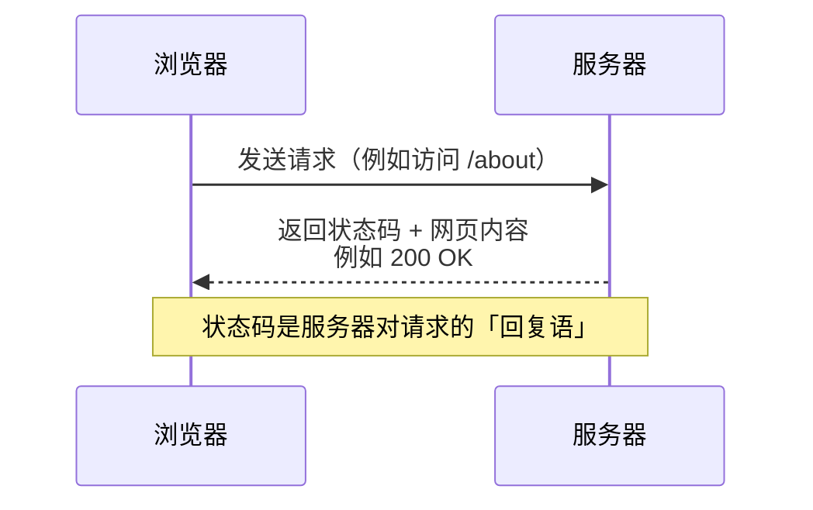
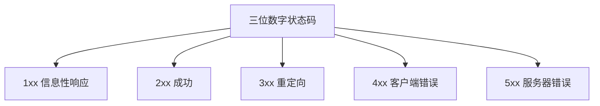
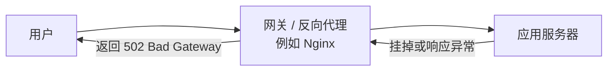

浏览网页时突然弹出「404 Not Found」「502 Bad Gateway」，你大概率一脸茫然：这些数字到底在说什么？是我电脑坏了，还是网站坏了？

其实这是网络的一个状态码，即**HTTP 状态码**

**HTTP 状态码是服务器在收到浏览器请求后，返回的三位数字「回执」，用来告诉你这次请求的结果如何。**

## 一次请求的完整旅程

在理解状态码之前，先看一次普通的网页请求发生了什么：

当你输入网址、按下回车，浏览器会向服务器发送一个 HTTP 请求。服务器处理完毕后，会返回一个三位数的状态码，外加网页内容或其他信息。状态码就是服务器与浏览器之间的「暗号」，用简短的数字表达复杂的结果。

这三位数还可以进一步分解：**第一位数字代表响应的大类，后两位是具体细节。**

## 状态码的五大家族

| 分类 | 含义 | 一句话理解 |
| --- | --- | --- |
| 1xx | 信息性响应 | 服务器说「收到，继续」 |
| 2xx | 成功 | 请求成功了 |
| 3xx | 重定向 | 你要的东西不在这，去那边找 |
| 4xx | 客户端错误 | 问题出在你这边（比如地址写错） |
| 5xx | 服务器错误 | 问题出在服务器那边 |

判断口诀很简单：**4 开头的错在「你」，5 开头的错在「服务器」**。这是理解状态码最关键的一句话。

## 2xx：一切顺利

### 200 OK——最常见的好消息

`200 OK` 是最理想的状态：请求成功，服务器把你要的内容正常返回了。你平时打开网页，十有八九都是这个状态码。

类似的好消息还有：

| 状态码 | 含义 | 使用场景 |
| --- | --- | --- |
| 201 Created | 创建成功 | 提交表单后，服务器成功创建了新资源 |
| 204 No Content | 成功但没有内容 | 删除操作成功，无需返回任何内容 |

## 3xx：请往这边走

### 301 和 302——永久搬家与临时搬走

`301 Moved Permanently` 表示网页**永久搬家**了，搜索引擎会把旧地址的权重转移到新地址。`302 Found` 则表示**临时转移**，比如网站维护时临时跳转到提示页。

### 304 Not Modified——用缓存省流量

`304 Not Modified` 是个很「聪明」的状态码：你第二次访问同一个网页时，浏览器会问服务器「内容变了吗？」如果没变，服务器返回 304，浏览器直接使用本地缓存的旧内容。既省流量又更快。

## 4xx：问题在你这边

4xx 系列是大家最熟悉的「受害者」，因为它们几乎都意味着请求本身有问题。

### 400 Bad Request——请求语法不对

服务器看不懂你的请求。通常是因为请求格式错误、参数缺失或不符合接口要求。比如向一个只接受 JSON 的接口发送了普通字符串。

### 401 Unauthorized——还没登录

意思是「请先证明你是谁」。访问需要登录的页面但没有提供凭证（比如没登录），服务器就会返回 401。

### 403 Forbidden——没有权限

和 401 不同，**403 表示服务器认识你，但拒绝你进入**。比如你登录了一个普通账号，却试图访问管理员专属页面。常见的还有：服务器开启了目录禁止访问，你试图直接浏览某个文件夹。

### 404 Not Found——最著名的状态码

`404 Not Found` 可能是互联网上最出名的数字，意思是 **服务器找不到你请求的资源**。可能的原因：

1. 网址拼写错误
2. 页面被删除或移动后没有设置跳转
3. 链接是过时的死链

## 5xx：问题在服务器

5xx 系列意味着请求本身没问题，但服务器在处理时出了岔子。

### 500 Internal Server Error——服务器内部错误

这是最「笼统」的错误码，表示服务器遇到了意外情况、没能完成请求。可能是代码抛出了异常、数据库连接失败，或配置文件出错。网站开发者看到 500 通常会去翻服务器日志找具体原因。

### 502 Bad Gateway——网关收到坏响应

`502 Bad Gateway` 常常出现在使用了反向代理的网站架构中。看这幅图：

网关（如 Nginx）把请求转发给后端的应用服务器，但后端没有给出合法响应（比如后端崩溃、连接超时），网关就只能向用户报告 502。

### 503 Service Unavailable——服务暂时不可用

服务器暂时无法处理请求，通常是**过载或正在维护**。503 一般都附带 `Retry-After` 消息头，告诉用户「请过一会儿再试」。

### 504 Gateway Timeout——网关等超时了

`504 Gateway Timeout` 和 502 是「兄弟」。502 是网关收到了坏响应，504 是网关**等太久没等到响应**——上游服务器处理得太慢，超过了时间限制。

## 一张表记住最常见的状态码

| 状态码 | 英文名 | 中文含义 | 该怪谁 | 常见场景 |
| --- | --- | --- | --- | --- |
| 200 | OK | 成功 | — | 正常打开网页 |
| 301 | Moved Permanently | 永久重定向 | — | 网站换域名 |
| 302 | Found | 临时重定向 | — | 临时跳转到登录页 |
| 304 | Not Modified | 未修改 | — | 使用浏览器缓存 |
| 400 | Bad Request | 请求错误 | 客户端 | 接口参数格式不对 |
| 401 | Unauthorized | 未认证 | 客户端 | 没登录就访问 |
| 403 | Forbidden | 禁止访问 | 客户端 | 无权限访问管理员页面 |
| 404 | Not Found | 资源不存在 | 客户端 | 网址写错或页面被删 |
| 500 | Internal Server Error | 服务器内部错误 | 服务器 | 后端代码抛异常 |
| 502 | Bad Gateway | 网关收到坏响应 | 服务器 | 后端服务崩溃 |
| 503 | Service Unavailable | 服务不可用 | 服务器 | 网站维护或过载 |
| 504 | Gateway Timeout | 网关超时 | 服务器 | 后端响应太慢 |

## 遇到状态码该怎么办？

### 遇到 4xx：先检查自己

1. **检查网址**：有没有拼写错误、多了或少了一个字母
2. **检查参数**：URL 后面的参数格式是否符合要求
3. **检查登录状态**：是否已登录、权限是否足够
4. **检查链接来源**：如果是别人发的链接，可能是对方发错了

### 遇到 5xx：稍安勿躁

1. **刷新页面**：有时只是服务器瞬时抖动
2. **稍后再试**：503 通常过一会儿就好了
3. **查询网站公告**：许多网站在维护前会提前公告
4. **联系网站管理员**：如果长时间无法访问，可能是网站出了问题

## 小结

HTTP 状态码是服务器对每次请求的「体检报告」，三位数字浓缩了请求的最终结果。
